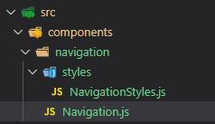
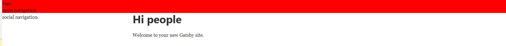
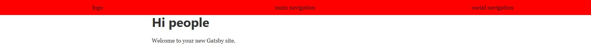
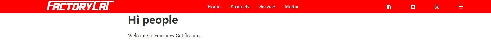
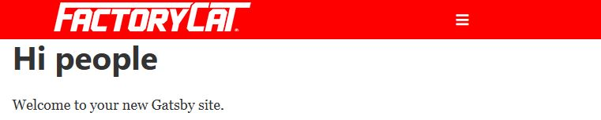
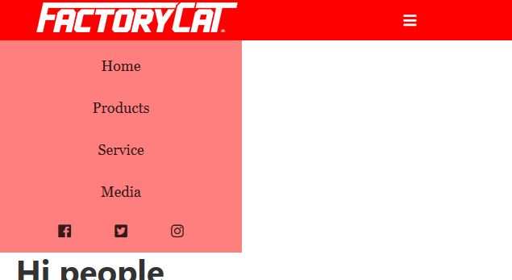

Build a responsive navigation in React using React Hooks, with Grid and Flex Box.

One of the first things I taught myself was how to build a responsive navigation. There are a multitude of libraries and plug-ins available to do this, but what happens when an employer or a client wants the navigation to do this or that and your plug-in isn’t very accommodating.? The goal of this tutorial to give you a basic understanding of how to accommodate these circumstances from scratch.  
Side Note: This is my first attempt at writing a tutorial. All criticism is welcome 😊

For this tutorial I’m using React, GatsbyJS, and styled components. If you’re not using React no worries this should be simple enough to translate into any stack.

If you would like to follow along using the same tools see below. All code is available on GitHub at https://github.com/GeekLifeDevelopment/Responsive-Navigation

##What We’re Using

- GatsbyJS – gatsbyjs.org
- Styled-Components – styled-components.com
- React Hooks (for some animation and passing css.) – More on React Hooks
- Grid-Box
- Flex-Box
- Font-Awesome – fontawesome.com

##Set-Up
For our navigation we will only need two components. Navigation.js (the main component) and the NavigationStyles.js (our styled-component.) My file structure looks like this.



##Step 1. Creating our components
Now it’s time to start putting some things together. To start let’s put together the building blocks for our two components.

##Navigation.js

```
import React from "react"
import { useState } from "react"
import { NavigationStyles } from "./styles/NavigationStyles"

const Navigation = () => {
return (
<NavigationStyles>
    <div id="nav-container"></div>
</NavigationStyles>
    )
}

export default Navigation

```

##NavigationStyles.js

```
import styled from 'styled-components'

export const NavigationStyles = styled.div`
    color:
```

###Explanation
First the Navigation component. This is a functional component that will hold the actual navigation, and eventually our React Hook. We are importing our styles (NavigationStyles), and useState (more on this later), but we can add it for now. The rest of the component lays out our container with an id of nav-container. If your not familiar with styled-compoents the <NavigationStyles> component is wrapping the our main component so we can add our styles.

##Step 2. Setting up our navigation sections
Next, we will set up some divs that will hold our navigation. We will have our logo, main navigation, and some social network icons. We are going to set this up using Grid-Box so we have three distinct sections. Let’s set this up with some place-holder text for now.

```
const Navigation = () => {
  return (
    <NavigationStyles>
      <div id="nav-container">
          <div id="logo">logo</div>
          <div id="main-nav">main navigation</div>
          <div id='social-nav'>social navigation</div>
      </div>
    </NavigationStyles>
  )
}
```

##Step 3. Create our container
First set up your basic container styles inside of NavigationStyles.js If everything is working right you should see something similar to the image below.

```
export const NavigationStyles = styled.div`
#nav-container {
    width: 100%;
    height: 50px;
    background-color: red;
}`

```


Not very exciting, I know. let’s introduce the Grid-Box and some rules to space things out.

##Step 4. Adding Grid and spacing.

```
export const NavigationStyles = styled.div`
  #nav-container {
    display: grid;
    grid-template-columns: 33.3% 33.3% 33.3%;
    justify-items: center;
    align-items: center;
    width: 100%;
    height: 50px;
    background-color: red;
  }
```

If everything was set up correctly you should now see things starting to look like so…



###Explanation
What we did here was tell our #nav-container that we would like to display our content in a grid with display: grid, and next we told it we want three equal columns by declaring our grid-template-columns with 33.3% for each column that we would like. You can adjust this anyway you would like, but for our purposes we will keep it simple 😊. Lastly, we justified our content by adding justify-items to center our content along the X-axis while align-items centers along the y-axis.

##Step 5. Adding real stuff
Now let’s add some real content to our nav and get rid of that boring text. I’m using a logo from a current project I am working on.
Couple of notes, I am using the Helmet component to do a quick add in of the fontawesome library. Also, I import my logo for the image. If you are not using Gatsby or React you can bring these things in any way you would like.

```
const Navigation = () => {
  return (
    <NavigationStyles>
      <>
        <Helmet>
          <link
            rel="stylesheet"
            href="https://use.fontawesome.com/releases/v5.5.0/css/all.css"
            integrity="sha384-B4dIYHKNBt8Bc12p+WXckhzcICo0wtJAoU8YZTY5qE0Id1GSseTk6S+L3BlXeVIU"
            crossOrigin="anonymous"
          />
        </Helmet>
        <div id="nav-container">
          <div id="logo">
            
          </div>
          <div id="main-nav">
            <p>Home</p>
            <p>Products</p>
            <p>Service</p>
            <p>Media</p>
          </div>
          <div id="social-nav">
            <i className="fab fa-facebook"></i>
            <i className="fab fa-twitter-square"></i>
            <i className="fab fa-instagram"></i>
            <i className="fas fa-bars"></i>
          </div>
           <div id="responsive-bars">
           <i className="fas fa-bars"></i>
          </div>
        </div>
      </>
    </NavigationStyles>
  )
}


```

##Step 6. Add the styles – back in the NavigationStyles file

```
#logo {
    img {
      margin: 0;
    }
  }

  #main-nav {
    display: flex;
    /* align-items: center; */
    list-style-type: none;

    p {
      margin: 0 1rem;
    }
  }

  #social-nav {
    display: flex;
    i {
      margin: 0 2rem;
    }
  }

```

###Explanation
Here we are using flex-box and some simple margining to display our content evenly on the page. We should be looking at something like this now.



Notice how our “hamburger” menu is showing next to our social icons. We will fix that next.

##Step 6. Hide “hamburger” menu and display when it’s necessary.
We can accomplish this with a simple CSS media query.

```
.fa-bars {
    display: none;

    @media (max-width: 1020px) {
      display: block;
    }
  }

```

##Step 7. Hide the menu items
Using more media queries, we can now hide the other elements we don’t want to see. We will also tweak the Grid of the main component.

```
#nav-container {
    display: grid;
    grid-template-columns: 33.3% 33.3% 33.3%;
    justify-items: center;
    align-items: center;
    width: 100%;
    height: 50px;
    background-color: red;
    color: white;

    @media (max-width: 1020px) {
      grid-template-columns: 50% 50%;
    }
  }

  #logo {
    img {
      margin: 0;
    }
  }

  #main-nav {
    display: flex;
    /* align-items: center; */
    list-style-type: none;

    p {
      margin: 0 1rem;
    }
    @media (max-width: 1020px) {
      display: none;
    }
  }

  #social-nav {
    display: flex;
    i {
      margin: 0 2rem;
    }
    @media (max-width: 1020px) {
      display: none;
    }
  }

  .fa-bars {
    display: none;
    justify-self: left;

    @media (max-width: 1020px) {
      display: block;
    }
  }

```

###Explanation
We use media queries to change the display properties. We are using 1020px, but every application is a little different and you can adjust to fit your app. We also change the number of columns from three down to two in the main navigation since we now only have two columns. When you resize the screen you should see our main, and social links vanish and our hamburger menu and logo still displaying.

Now with that out of the way lest create the mobile navigation.
##Step 8. Create our mobile navigation
You can do this several ways. For our purpose we will be creating a navigation that slides in from the left when the hamburger menu is pushed. Lets start by creating our mobile navigation. Back in the Navigation.js add

```
<div id="mobile-navigation">
          <p>Home</p>
          <p>Products</p>
          <p>Service</p>
          <p>Media</p>
          <div id="social-nav-mobile">
            <i className="fab fa-facebook"></i>
            <i className="fab fa-twitter-square"></i>
            <i className="fab fa-instagram"></i>
          </div>
        </div>
```

Let’s also add the CSS

```
#mobile-navigation {
    width: 300px;
    background-color: rgba(255, 0, 0, 0.5);
    padding: 1rem;
    p {
      text-align: center;
    }

    #social-nav-mobile {
      display: flex;
      justify-content: space-evenly;
    }
  }

```

###Explanation
For simplicity we are adding our mobile nav right in the same file. Depending on the application you may consider making this its own component. You can see what we are doing is creating a navigation that will lay out vertically on our page. Right now, you should be seeing the mobile nav on the page regardless of the size of screen.

##Step 9 – Hide the Nav
We are going to take a different approach this time. Instead of using display none or block we are going to use negative margin and a transition delay to add a little animation. We do this by adding a couple of lines to our styles. Since we are using React Hooks for the animation, we are going to add an inline style as well.

```
#mobile-navigation {
    width: 300px;
    background-color: rgba(255, 0, 0, 0.5);
    padding: 1rem;
    margin-left: -325px;
    transition-duration: 0.5s;
    p {
      text-align: center;
    }

    #social-nav-mobile {
      display: flex;
      justify-content: space-evenly;
    }
  }
```

```
<div style={{ marginLeft: marginToggle }} id="mobile-navigation">
        <p>Home</p>
        <p>Products</p>
        <p>Service</p>
        <p>Media</p>
        <div id="social-nav-mobile">
          <i className="fab fa-facebook"></i>
          <i className="fab fa-twitter-square"></i>
          <i className="fab fa-instagram"></i>
        </div>
      </div>

```

##Step 9. Create our hook.
If this is the first time you have used React hooks, don’t fret. This is a real easy to understand use of them. I will also have links to tutorials I have used in the past that have a great explanation. We also set up our click function that we will be using to pass down if our menu is open or not. You code should look like this.

```
const Navigation = () => {
  const [marginToggle, setToggle] = useState("-325px")

  function toggleMenu() {
    if (marginToggle === "-325px") {
      setToggle("0")
    } else setToggle("-325px")
  }
  return (
    <NavigationStyles>
      <>
        <Helmet>
          <link
            rel="stylesheet"
            href="https://use.fontawesome.com/releases/v5.5.0/css/all.css"
            integrity="sha384-B4dIYHKNBt8Bc12p+WXckhzcICo0wtJAoU8YZTY5qE0Id1GSseTk6S+L3BlXeVIU"
            crossOrigin="anonymous"
          />
        </Helmet>
        <div id="nav-container">
          <div id="logo">
            
          </div>
          <div id="main-nav">
            <p>Home</p>
            <p>Products</p>
            <p>Service</p>
            <p>Media</p>
          </div>
          <div id="social-nav">
            <i className="fab fa-facebook"></i>
            <i className="fab fa-twitter-square"></i>
            <i className="fab fa-instagram"></i>
          </div>
          <div onClick={toggleMenu} id="responsive-bars">
            <i className="fas fa-bars"></i>
          </div>
        </div>


```

That’s It! With any luck you should have a functioning responsive navigation. Hopefully you found this tutorial worthwhile.

##Resources

- GatsbyJS – https://gatsbyjs.org
- React Hooks - https://reactjs.org/docs/hooks-overview.html
- Grid-Box (this guys tutorial is awesome) - https://mastery.games/
